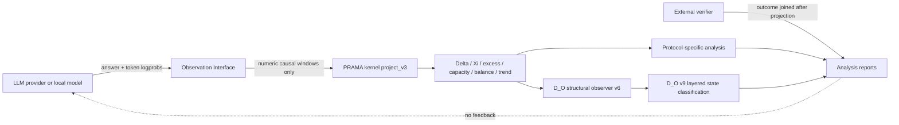

# Repository architecture and evidence boundaries

## Purpose

This repository contains an LLM-domain observation interface, experimental runners,
external verifiers and analysis layers around the independently maintained PRAMA
kernel. It does not contain a substitute implementation of that kernel.

## Execution architecture

The model payload contains only the task prompt and declared generation parameters.
PRAMA labels, interface identity, experimental condition and verifier outcomes are not
fed to the model. Response latency is metadata and is not a structural observable.

## Program boundary

### D_O v9

D_O v9 is an exploratory Observation Interface layer. It classifies transport status
and mobility using causal numeric windows after the PRAMA projection. It is useful for
hypothesis generation, fixed-horizon descriptive analysis and prospective protocol
design. Confirmatory claims require their own frozen protocol and evidence binding.

Historical v9 replay has an additional boundary: historical answers may come from the
kernel-v1 era while Delta and Xi are recomputed with the current recertified kernel.
Such output is a counterfactual replay of old numeric observations, not “v9 on kernel
v1.” A kernel-effect comparison requires matched replay through reconstructed v1 and
current kernels while holding the v9 observer fixed.

## Repository material classes

### Implementation

- `src/aptadynamic_llm/`: reusable library code;
- `scripts/`: acquisition, projection, verification and analysis entry points;
- `config/` and `schemas/`: frozen declarations and machine-readable contracts;
- `FrontEnd/`: human interaction surface; it does not expose monitor state to models;
- `tests/` and `.github/workflows/`: executable regression checks.

### Retained data

`data/` contains immutable experimental inputs. Inclusion in
`data/retained_manifest_v1.json` means the exact byte content is intentionally retained.
It does not mean the data are an outcome or a confirmatory result. The largest dataset
is stored through Git LFS.

### Reproducible results

`run_outputs/` contains both curated results and exploratory run material. Only files
bound by `run_outputs/reproducible_results_manifest_v1.json` are canonical reproducible
results. Other directories may be useful evidence but are not stable API surfaces.

## Kernel identity

`config/kernel.lock.json` is the repository lock. It binds:

- package version and exact Git commit;
- source-tree SHA-256;
- window-scale kernel API and configuration SHA-256;
- declaration SHA-256;
- passing numerical recertification SHA-256.

`pyproject.toml` pins the same Git commit. Runtime projection additionally compares the
installed source tree with the declaration and recertification and fails closed on any
mismatch.

## Verifier boundary

CoCC candidates run in an isolated child process. A missing requested callable is
recognized only when both conditions hold:

1. exception class is `AttributeError`;
2. the exception message exactly matches `callable '<identifier>' not found`.

An unrelated `AttributeError` raised inside candidate code remains a candidate runtime
exception. The verifier records both sanitized exception class and message, and the
parent process rejects inconsistent worker classifications.

This is not a strong operating-system sandbox. The current `python -I` child process,
AST deny-list and external timeout are suitable only for controlled research inputs.
The production isolation requirements and threat boundary are documented in
[`VERIFIER_SECURITY.md`](VERIFIER_SECURITY.md).
