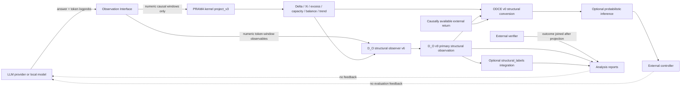

# Repository architecture and evidence boundaries

## Purpose

This repository contains an LLM-domain observation interface, experimental runners,
external verifiers and analysis layers around the independently maintained PRAMA
kernel. It does not contain a substitute implementation of that kernel.

## Execution architecture



The model payload contains only the task prompt and declared generation parameters.
PRAMA labels, interface identity, experimental condition and verifier outcomes are not
fed to the model. Response latency and provider termination metadata are not structural
observables.

## Program boundary

### D_O v9

D_O v9 is the primary structural observer of PRAMA-projected trajectories. It
classifies transport status, recurrence, contraction and coherent mobility using
causal numeric windows after kernel projection. It is not the Observation Interface:
`O_D != D_O_v9`. The interface ends at the causal numeric input pair; D_O v9 begins
after the kernel state has been projected.

The canonical output is the `structural_observation` artifact. The executable entry
point is `scripts/observe_structural_trajectory.py`. `structural_labels` is an
optional, secondary integration layer: it combines a referenced D_O v9 observation
with coupling, external-anchor, perturbation and historical evidence to produce a
`monitor.*` annotation. It is not a substitute for the observer.

Architectural primacy does not imply empirical confirmation. Current studies remain
exploratory unless a prospective protocol freezes its endpoints, thresholds and
evidence binding.

### ODCE-v0 and the inferential boundary

The Structural Conversion Differential is downstream of both the kernel and the
primary structural observer:

```text
Gamma[1:t] + Q[1:t] + causally available Y[1:t]
  -> ODCE-v0
  -> normalized cost vector + normalized return vector + differential vector
  -> optional probabilistic inference
  -> external controller
```

ODCE neither modifies PRAMA nor reclassifies D_O v9. It is a causal descriptive
object that asks what verified structure or function was obtained for the historical
structural cost paid. It may consume an external measurement only after that
measurement exists; a session-final outcome cannot appear in earlier ODCE windows.
Missing channels are explicit statuses, never zeros.

Domain returns carry distinct event and availability indices, each bound to a
canonical `(turn_index, window_index)` identity. ODCE joins by that identity and
admits a return only at `available_at_index`, even when the event occurred earlier.
Rolling-window coordinates, session-to-date coordinates, latest-available returns,
current-index differentials, one-step trend, rolling persistence, and session-to-date
exposure are declared separately.
The cumulative conversion-deficit exposure is irreversible: missing or negative
differentials never decrement it.

The probabilistic inferential layer is not implemented by ODCE. It becomes justified
only under a separately frozen prospective protocol showing incremental performance
over Delta, Xi, capacity, trend, D_O v9 channels and domain baselines. Predictions and
controller actions remain outside the evaluated model and cannot feed back during an
outcome-blind evaluation.

The canonical implementation is `aptadynamic_llm.structural_conversion`, its entry
point is `scripts/derive_structural_conversion.py`, its schema is
`schemas/structural-conversion-differential.schema.json`, and the initial development
contract is `config/odce_v0_1_exploratory.json`. That contract uses identity
normalization only and therefore rejects `--partition confirmatory`.
A future confirmatory contract must bind domain-calibration and correspondence
provenance and be accompanied by a separate prospective freeze manifest. The
derivation CLI verifies all canonical hashes and records the freeze hash in every
confirmatory ODCE artifact; a status-only promotion fails closed.

Before that stage, exploratory calibration is a separate, non-freezing operation.
It fits robust coordinate-wise normalization only where observed coverage and scale
are sufficient, preserves missingness elsewhere, and emits a blocker report. Its
index-level estimates are development diagnostics rather than a substitute for
domain-representative, cluster-aware calibration.

Historical v9 replay has an additional boundary: historical answers may come from the
kernel-v1 era while Delta and Xi are recomputed with the current recertified kernel.
Such output is a counterfactual replay of old numeric observations, not “v9 on kernel
v1.” A kernel-effect comparison requires matched replay through reconstructed v1 and
current kernels while holding the v9 observer fixed.

## Repository material classes

### Implementation

- `src/aptadynamic_llm/`: reusable library code;
- `scripts/`: acquisition, projection, verification and analysis entry points;
- `config/` and `schemas/`: frozen declarations and machine-readable contracts;
- `FrontEnd/`: human interaction surface; it does not expose monitor state to models;
- `tests/` and `.github/workflows/`: executable regression checks.

### Retained data

`data/` contains immutable experimental inputs. Inclusion in
`data/retained_manifest_v1.json` means the exact byte content is intentionally retained.
It does not mean the data are an outcome or a confirmatory result. The largest dataset
is stored through Git LFS.

### Reproducible results

`run_outputs/` contains both curated results and exploratory run material. Only files
bound by `run_outputs/reproducible_results_manifest_v1.json` are canonical reproducible
results. Other directories may be useful evidence but are not stable API surfaces.

## Kernel identity

`config/kernel.lock.json` is the repository lock. It binds:

- package version and exact Git commit;
- source-tree SHA-256;
- window-scale kernel API and configuration SHA-256;
- declaration SHA-256;
- passing numerical recertification SHA-256.

`pyproject.toml` pins the same Git commit. Runtime projection additionally compares the
installed source tree with the declaration and recertification and fails closed on any
mismatch.

## Verifier boundary

CoCC candidates run in an isolated child process. A missing requested callable is
recognized only when both conditions hold:

1. exception class is `AttributeError`;
2. the exception message exactly matches `callable '<identifier>' not found`.

An unrelated `AttributeError` raised inside candidate code remains a candidate runtime
exception. The verifier records both sanitized exception class and message, and the
parent process rejects inconsistent worker classifications.

This is not a strong operating-system sandbox. The current `python -I` child process,
AST deny-list and external timeout are suitable only for controlled research inputs.
The production isolation requirements and threat boundary are documented in
[`VERIFIER_SECURITY.md`](VERIFIER_SECURITY.md).
